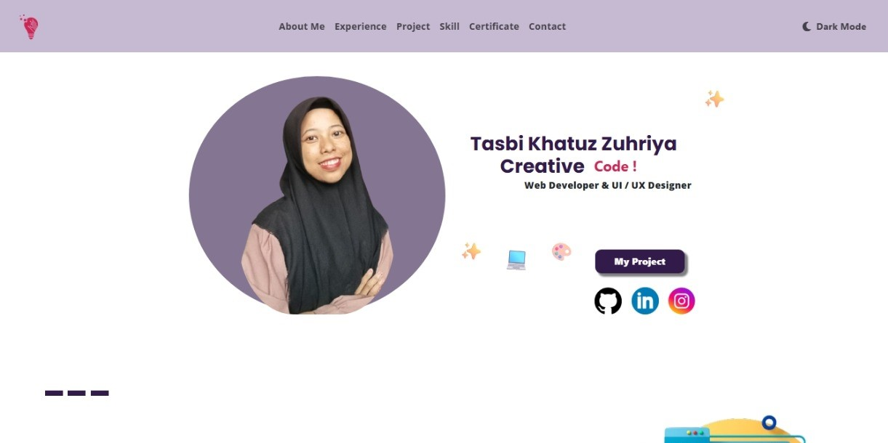

# Tasbi Portfolio Website

This is my personal portfolio website that showcases my profile, work experience, projects, technical skills, and certifications.

The website was created to present my background and development work in a clean, modern, and responsive interface.

## 📌 Description

This portfolio website serves as a central place to display information about me as a web developer. Visitors can learn about my professional background, explore the projects I have built, and view the skills and certifications I have obtained.

The website is designed with a simple and responsive layout so it can be accessed easily on different devices.

## 🚀 Features

* Personal profile section
* Work experience history
* Projects showcase
* Skills and technologies section
* Certifications section
* Responsive design for desktop and mobile
* Clean and modern user interface

## 🛠️ Tech Stack

  
  
  
  

## 🖼️ Website Preview

## 💻 Live Demo

https://portofolio-tasbi.vercel.app/

## 📱 Responsive Design

This website is designed to work well on:

* Desktop
* Tablet
* Mobile

## 👨‍💻 Developer

Tasbi Khatuz Zuhriya

This project was developed as my personal portfolio website to showcase my work and experience as a web developer.
